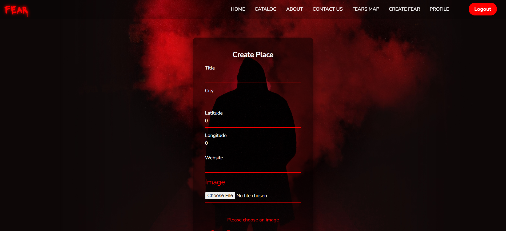
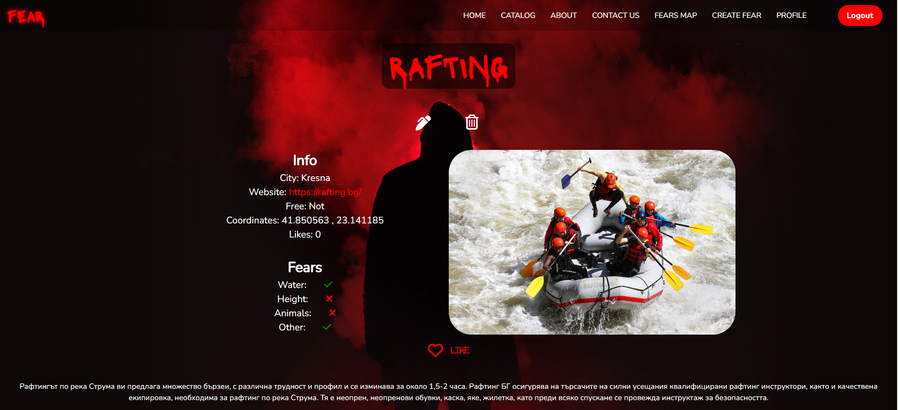
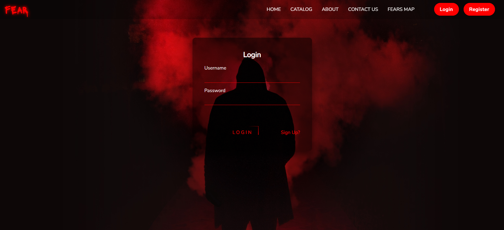
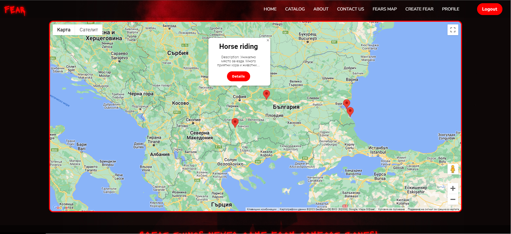

# Fear

Fear is web application for places where you can face your fears or just get a dose of adrenaline.

:dart:  My project for the ReactJS course at SoftUni. (February 2023) 

## :information_source: How It Works

- Guest visitors: 
  - browse fears catalog;
  - view base information about the fear;
  - view fears location on the map;
  - view simple home page;
- Logged Users:
  - can create fear; 
  - view full information about the fear (details); 
  - view top three liked fears on the home page;
  - can like fears;
- Fear Owner (user role):
  - can edit fear;
  - can delete fear;
  - can edit profile;
  - can delete profile;

## :hammer_and_pick: Built With

- 
- 
- 
- 
- 
- 
- 
- 
- 
- 
- 
- Google maps

## :gear: Live demo

  https://fear-ts.web.app/

## :framed_picture: Screenshots
### Catalog

### Create Fear

### Details

### Home with user

### Login

### Map

 

