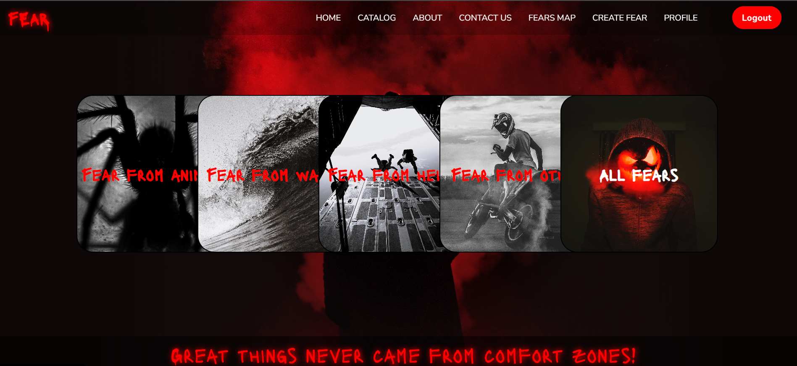

# Fear

Fear is web application for places where you can face your fears or just get a dose of adrenaline.

:dart:  My project for the ReactJS course at SoftUni. (February 2023) 

## :information_source: How It Works

- Guest visitors: 
  - browse fears catalog;
  - view base information about the fear;
  - view fears location on the map;
  - view simple home page;
- Logged Users:
  - can create fear; 
  - view full information about the fear (details); 
  - view top three liked fears on the home page;
  - can like fears;
- Fear Owner (user role):
  - can edit fear;
  - can delete fear;
  - can edit profile;
  - can delete profile;
- Admin:
  - can do anything

## :hammer_and_pick: Built With

- 
- 
- 
- 
- 
- 
- 
- Google maps
- Django

## :gear: Application Configurations
- Create PostgreSQL Docker container : https://hub.docker.com/_/postgres
- Run the server
- In the client directory use command npm start

## :framed_picture: Screenshots
### Catalog

 

